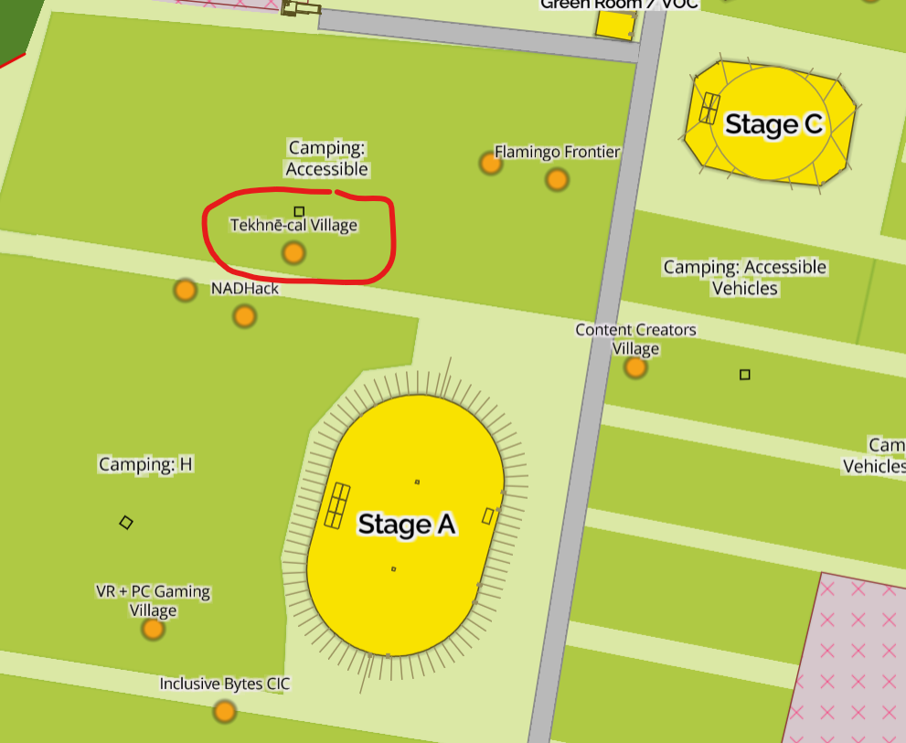

# EMF Solar System

We're building a solar system with planets created by EMF attendees. Come and make a contribution!

**[How to Contribute to the Solar System]()**

[Submit a completed planet](TODO) (link not yet working - check back soon!)

[View the Blanket online](TODO) (link not yet working - check back soon!)

[Follow on Mastodon](https://mastodon.me.uk/@emfblanket)

## Location

The solar system lives in [LOCATION TBC].

**If you're dropping off a planet, please [submit it to the website](TODO) before hanging it up** - see the [instructions](#add-your-planet-to-the-solar-system) for more info.

## Making your planet

See [Instructions for making your planet]().

There are many planet-making supplies and plenty of space for crafting in [Tekhnē-cal Village](https://wiki.emfcamp.org/2024/wiki/Tekhn%C4%93-cal_Village) (northwest of Stage A, [see on map](https://map.emfcamp.org/#17/52.040506/-2.378641)). Anyone is welcome to drop in and use the supplies and/or space to make a planet. See the [list of village supplies]().

The villages are focused on yarn and fabric crafts, but you can make a planet using whatever techniques you like. Get creative!

## Resources

[Patterns]()

[Stitch Reference]()
