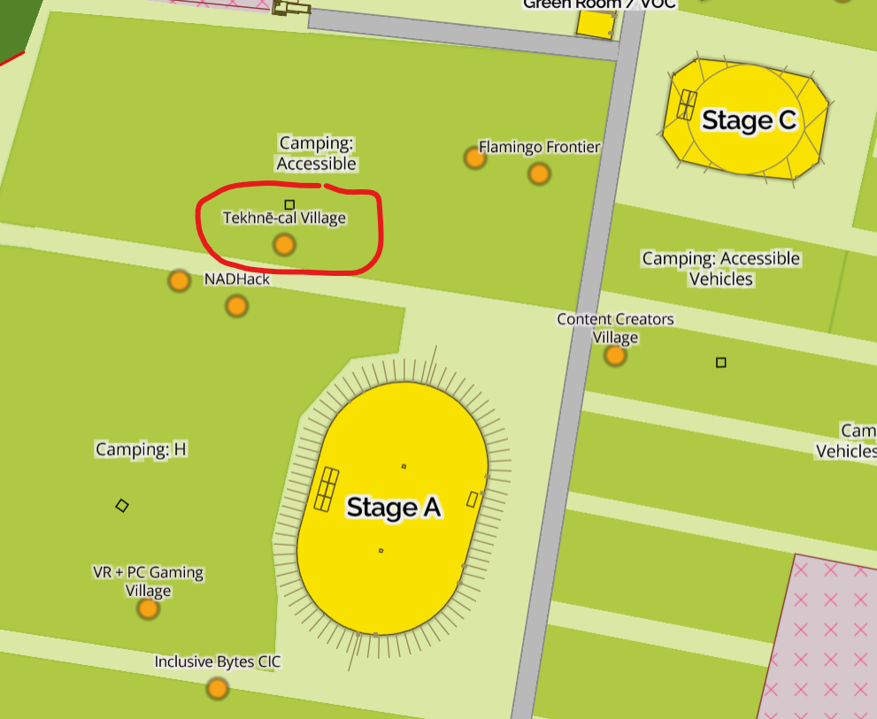

# EMF Community Blanket Documentation

We're building a blanket out of crochet and knit squares created by EMF attendees. Come and make a contribution! Beginners welcome.

**[How to Contribute to the Blanket](pages/contribute.md)**

[View the Blanket online](https://emf-community-blanket-32b26b9ba91e.herokuapp.com/blankets/2/)

[Follow on Mastodon](https://mastodon.me.uk/@emfblanket)

## Location

The blanket lives in [Tekhnē-cal Village](https://wiki.emfcamp.org/2024/wiki/Tekhn%C4%93-cal_Village) (northwest of Stage A, [see on map](https://map.emfcamp.org/#17/52.040506/-2.378641)).

There's space and yarn to make contributions there!

## Resources

[Patterns](pages/patterns.md)

[Stitch Reference](pages/stitch_reference.md)