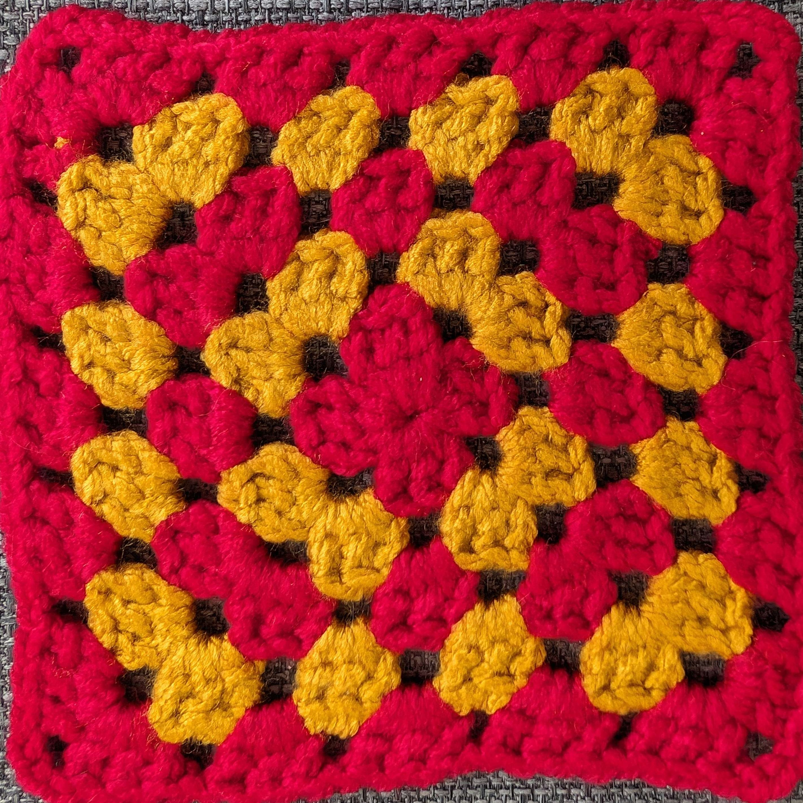

# Contribute to the Blanket

## Who can contribute?

Anyone can contribute, there is no need to have prior crochet or knitting experience.

[Tekhnē-cal Village](https://wiki.emfcamp.org/2024/wiki/Tekhn%C4%93-cal_Village) is home to the blanket; there will be instructions available there for self-guided crochet learning. Feel free to ask anyone you see there for help too!

If the typical crochet/knitting techniques are difficult for you, ask a villager for help. We can offer advice, adaptive tools, and alternative techniques, such as:
  * different ways to tension your yarn or hold your hook/needles
  * thick foam handles to make holding a crochet hook easier
  * knitting looms
  * finger knitting

## How do I add to the blanket?

### Create a contribution

Each contribution to the blanket should be a **15cm x 15cm** (6in x 6in) crochet or knit* square. Try to get as close to 15cm as possible without going over - dimensions between 14cm and 15.5cm are ideal. It is better for the square to be too small than too big (because you can always add an extra border to a smaller square if needed).

The design and colour(s) of the square are up to you! It can be as simple or as complicated as you like, as long as it fits the dimensions. You can also use techniques like surface crochet and embroidery to enhance your square. Check out [Patterns](patterns.md) for inspiration, or search the internet for more ideas.

You should use a yarn between DK (4mm) and chunky (6mm) weight. Any fibre is acceptable. The [village](https://wiki.emfcamp.org/2024/wiki/Tekhn%C4%93-cal_Village) has a stash of DK and chunky yarn that anyone can use (note this is *separate* to the stash swap table that's also present in the village, please don't take the blanket supplies away with you!)

\* <small>other forms of crafted square may be accepted as long as they can be sewn into the blanket with yarn and a [blunt tapestry needle](https://stitchedmodern.com/collections/tools-notions/products/plastic-tapestry-needle?variant=31337407676529).</small>

### Catalogue your square online

[The blanket can be viewed online](https://emf-community-blanket-32b26b9ba91e.herokuapp.com/blankets/2/) as well as in real life! Please help us keep it up to date by adding your square to the catalogue.

Take a photo of your square, and crop it so that:

* the image is square (aspect ratio 1:1)
* the corners of the image are cropped as close as possible to the corners of the square, without cutting off part of the square

This doesn't need to be perfect, just remove as much background as possible - see the example below.

When you have a photo ready, visit the [Submit a Square](https://emf-community-blanket-32b26b9ba91e.herokuapp.com/squares/add/) page. Upload your image, and optionally enter your name so we know who made the square! You can also give your square a name, and/or add any notes you'd like people to know about it (e.g. why you chose your design, or what the colours represent).

### Add your contribution to the blanket

First, make sure you have added your square to the [online catalogue](#catalogue-your-square-online), so we can keep the online blanket in sync with the real one!

When you've done that, bring your square to [Tekhnē-cal Village](https://wiki.emfcamp.org/2024/wiki/Tekhn%C4%93-cal_Village). The village can be found where the Accessible Camping area meets Camping H, ([see on map](https://map.emfcamp.org/#17/52.040506/-2.378641)).

Guides there (either human or written) will show you where to join your square to the blanket. Ideally, use the [whip stitch](https://easycrochet.com/whip-stitch-crochet-technique/), but any sewing method will do.

**Please don't leave without sewing your square in!** It creates extra work for someone else, and sewing a lot of squares takes a very long time. (The exception is if you're not sure where to sew in, and you promise us (by voice or note) you'll come back and do it later. You're also exempt if you physically can't do the sewing for accessibility reasons.)

<!--You can also send in squares by EMF internal post and someone will sew them in for you - please include a note for the catalogue! -->

### Share it online!

Please share pictures of your contribution and/or the whole blanket online and encourage others to visit the village!

## FAQ

### Can I make multiple squares?

Yes!

### How long will it take to make a square?

If you're new to crochet: allow 1-2 hours (time depends on your learning pace).

If you know how to crochet: allow 20 min-1 hour (time depends on your choice of pattern).

These are lower bounds - you can choose to spend longer than this to make something more complex!

### Where can I get yarn?

There is plenty of yarn in [Tekhnē-cal Village](https://wiki.emfcamp.org/2024/wiki/Tekhn%C4%93-cal_Village) that anyone is free to use. At the end of the weekend you may also be able to take some home with you - keep an eye on [Mastodon](https://mastodon.me.uk/@emfblanket) for announcements.

### Will there be helpers at the village?

There will not be people present at every hour of the day, but there is likely to be someone there much of the time. Call the village phone on 8563 (TKNE) to find out if someone's there. You can also call [Eli](https://wiki.emfcamp.org/2024/wiki/User:Elichad) , the blanket organiser, on 9276 (YARN).

## Extra help

* Contact [Eli](https://wiki.emfcamp.org/2024/wiki/User:Elichad) if you're interested in helping keep things organised.
* Hang out in [Tekhnē-cal Village](https://wiki.emfcamp.org/2024/wiki/Tekhn%C4%93-cal_Village) if you'd like to help others make contributions or sew parts of the blanket together.

#### Advance contributions (no longer needed)

You are welcome to make a contribution (or contributions) ahead of EMF and bring it to the village after you arrive. If you can't make it to EMF, you can post squares to Eli - ask Eli directly for his address.

In particular, if you are an experienced crocheter/knitter, you can help create squares for each character in 'EMF2024' - claim a character on the [wiki page](https://wiki.emfcamp.org/2024/wiki/Community_Blanket) (now filled).