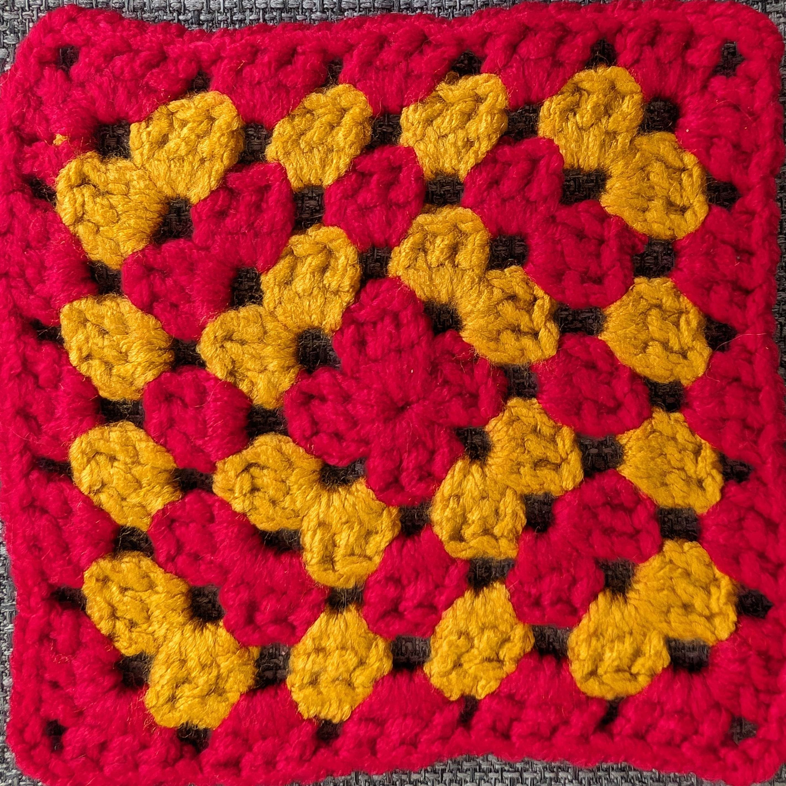

# Contribute to the Solar System

## Who can contribute?

Anyone can contribute, there is no need to have prior crafting experience.

[Tekhnē-cal Village][tekhne-cal] has many planet-making supplies and plenty of space for crafting; there will be numerous drop-in workshops throughout the weekend, as well as instructions available for self-guided crochet learning. Feel free to ask anyone you see there for help too!

## How do I add to the Solar System?

### Create a planet

Each planet should be **less than 30 cm diameter** and **light and soft enough not to hurt you if it fell on your head**.

Aside from these constraints, the design and colour(s) of the planet are up to you! It can be as simple or as complicated as you like. You can also use techniques like surface crochet and embroidery to enhance your planet. Check out [Patterns]() for inspiration, or search the internet for more ideas.

### Catalogue your planet online

[The solar system can be viewed online][view-system] as well as in real life! Please help us keep it up to date by adding your planet to the catalogue.

Take a photo of your planet, and crop it so that:

* the image is square (aspect ratio 1:1)
* the edges of the image are cropped as close as possible to the edges of the planet, without cutting off part of the planet

This doesn't need to be perfect, just remove as much background as possible - see the example below.

When you have a photo ready, visit the [Submit a Planet][submit-planet] page. Upload your image, and optionally enter your name so we know who made the square! You can also give your square a name, and/or add any notes you'd like people to know about it (e.g. why you chose your design, what the colours represent, or what the planet's weather/inhabitants are like).

### Add your contribution to the Solar System

First, make sure you have added your square to the [online catalogue](#catalogue-your-planet-online), so we can keep the online Solar System in sync with the real one!

When you've done that, bring your planet to [LOCATION TBC][location].

Guides there (either human or written) will show you how to hang your planet in the space. Make sure to add a physical tag to your planet with its name to help other people look it up on the website!

### Share it online!

Please share pictures of your planet and/or the whole solar system online and encourage others to visit!

## FAQ

### Can I make multiple planets?

Yes!

### How long will it take to make a planet?

#### Crochet

If you're new to crochet: allow 1-2 hours (time depends on your learning pace).

If you know how to crochet: allow 20 min-1 hour (time depends on your choice of pattern).

These are lower bounds - you can choose to spend longer than this to make something more complex!

#### Pom-poms

Allow 20 min-1 hour (time depends on your choice of pom-pom size & yarn)

#### Other crafts

Allow at least 20 min.

### Where can I get yarn?

There is plenty of yarn in [Tekhnē-cal Village][tekhne-cal] that anyone is free to use. At the end of the weekend you may also be able to take some home with you - keep an eye on [Mastodon](https://mastodon.me.uk/@emfblanket) for announcements.

### Will there be helpers at the village?

There will not be people present at every hour of the day, but there is likely to be someone there much of the time. Call the village phone on 8563 (TKNE) to find out if someone's there. You can also call [Eli][eli] , the solar system organiser, on 9276 (YARN).

## Extra help

* Contact [Eli][eli] if you're interested in helping keep things organised.
* Hang out in [Tekhnē-cal Village][tekhne-cal] if you'd like to help others make contributions.

#### Advance contributions

You are welcome to make a planet (or planets) ahead of EMF and bring it to the village after you arrive. If you can't make it to EMF, you can post squares to Eli - ask Eli directly for his address.

## Crochet/knitting contributions

[Tekhnē-cal Village][tekhne-cal] will host crochet and knitting drop-in workshops throughout the weekend, and instructions will be available for self-guided crochet learning - drop in any time!

If the typical crochet/knitting techniques are difficult for you, ask a villager for help. We can offer advice, adaptive tools, and alternative techniques, such as:
  * different ways to tension your yarn or hold your hook/needles
  * thick foam handles to make holding a crochet hook easier
  * knitting looms
  * finger knitting

You should use a yarn between DK (4mm) and chunky (6mm) weight. Any fibre is acceptable. The [village][tekhne-cal] has a stash of DK and chunky yarn that anyone can use (note this is *separate* to the stash swap table that's also present in the village, please don't take the blanket supplies away with you!)

\* <small>other forms of crafted square may be accepted as long as they can be sewn into the blanket with yarn and a [blunt tapestry needle](https://stitchedmodern.com/collections/tools-notions/products/plastic-tapestry-needle?variant=31337407676529).</small>

