# Crochet Planet

**Level:** Beginner

**Yarn weight:** Chunky (6.0mm hook) recommended, but any yarn can be used with an appropriately sized hook.

**Source:** [Eli][eli]'s brain, cross-referenced with <https://www.supergurumi.com/crochet-shapes-crochet-balls-and-spheres>. Step-by-step pictures by Eli.

## Stitch terminology

This pattern uses [US stitch terminology](https://easycrochet.com/uk-to-us-crochet-terms/) (the same as the EMF workshop teaches).

* ch: chain stitch
* st: stitch (any)
* sc: single crochet
* 1 st: one stitch into the next stitch from the row below
* X st: one stitch into each of the next X stitches from the row below
* increase: two single crochets into the next stitch [[video](https://www.youtube.com/shorts/5aDHW7yOICk)]
* round: in a circular pattern, rows are called rounds. You do not flip your work between rounds, so you are always working on the same side of the piece.
* decrease: insert your hook in the next stitch and pull up a loop as usual. Then, before finishing the stitch, insert your hook in the _next_ stitch along and pull up a loop (now 3 loops on hook). Yarn over and pull through all three loops. The stitch appears like an inverse V with two stitches at the bottom and one at the top. [[video](https://youtube.com/shorts/fB64nsKHGuQ?si=CnVuaXWe8dnm6MIU)]

**Tip:** Add a stitch marker to the last stitch of each round to help keep track of where you are in the pattern.

**Intermediate adaptation:** Use the "invisible decrease" instead of the decrease above. This stitch is slightly harder to work, but looks better when making 3D objects. Insert your hook in the front loop only of the first stitch, then _before pulling up a loop_, insert your hook into the front loop only of the next stitch as well. Pull up a loop through both stitches at once (now 2 loops on hook), then complete the stitch as usual. [[video](https://www.youtube.com/shorts/aKb9Yu1WzvQ)]

## Stage 1: Increasing

You'll start the planet by crocheting a flat circular panel using "increase" stitches. The more rounds you do, the larger your planet will be. If using 6mm yarn, doing 5 rounds in stage 1 will make a planet with a diameter of around 12 cm.

**Beginner adaptation:** decide roughly how much time you want to spend on your planet in total (45-60 mins recommended). Divide it by 3, and do as many rounds of stage 1 as you can in that amount of time.

**Foundation ring.** Work 4 ch and join with a ss to the first ch, forming a ring.

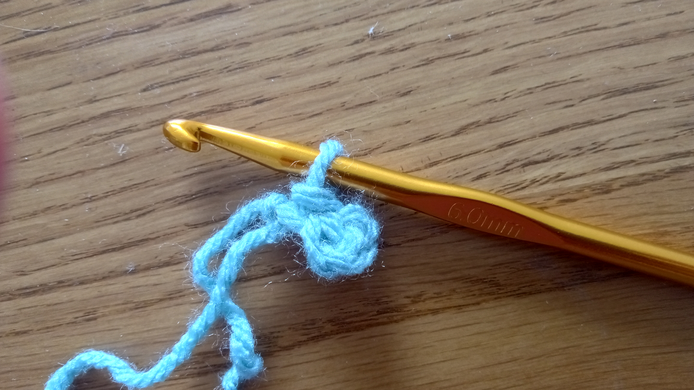

**Round 1:** 6 sc into the ring. (6 stitches)

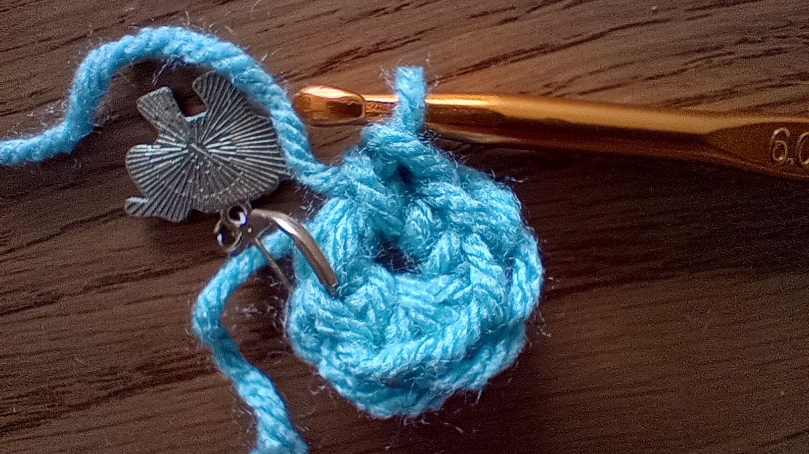

**Round 2:** 2 sc into next stitch (known as an "increase"), repeat until end of round. (12 stitches)

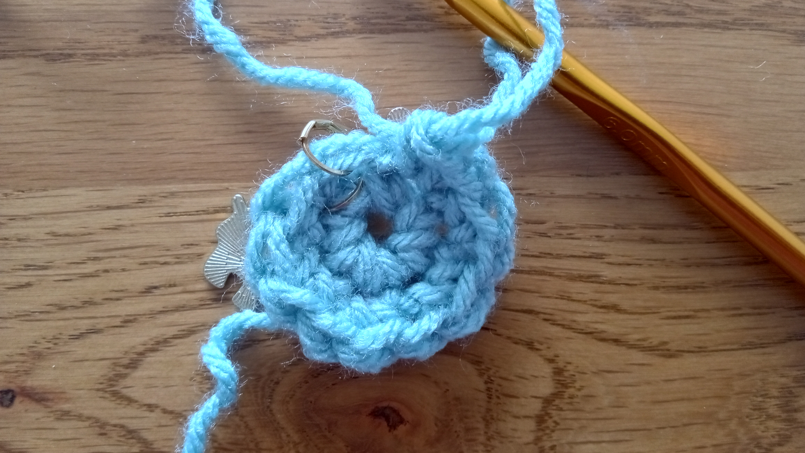

**Round 3:** 1 sc, 1 increase, repeat until end of round. (18 stitches)

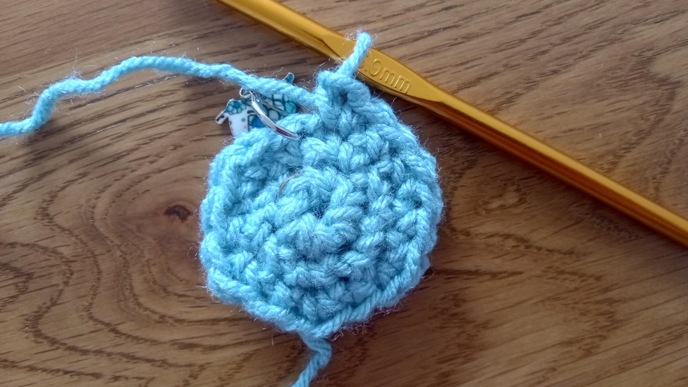

**Round 4:** 2 sc, 1 increase, repeat until end of round. (24 stitches)

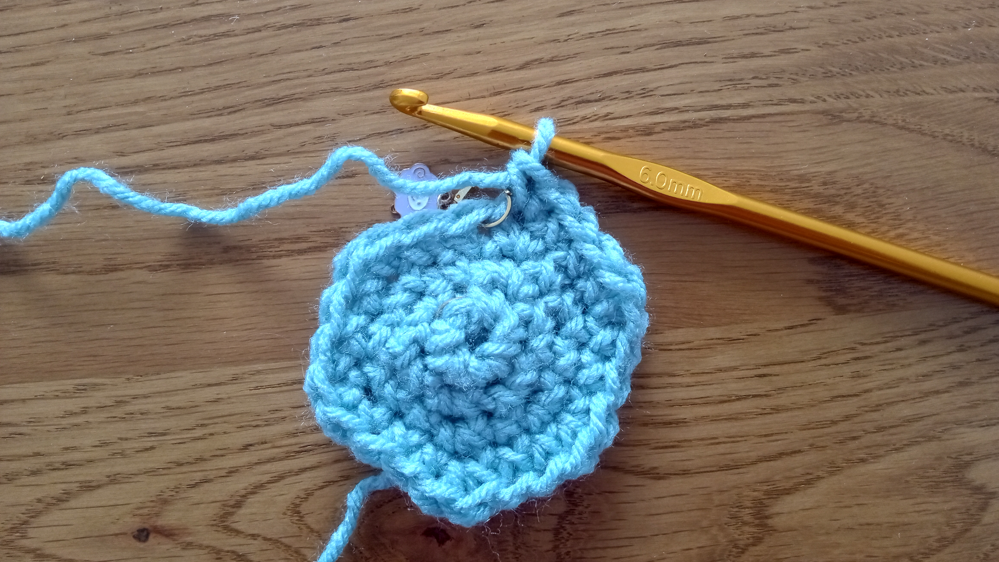

**Round 5:** 3 sc, 1 increase, repeat until end of round. (30 stitches)

**Round N:** N-2 sc, 1 increase, repeat until end of round. (N*6 stitches)

Make a note of how many rounds you did (N) before moving on to the next stage.

_Optional:_ change colour in the last stitch of this stage.

## Stage 2: the middle bit

You'll now stop increasing and crochet the same number of stitches every round.

For each round, make 1 sc in every stitch (N*6 stitches). Do the same number of rounds as you did in stage 1, plus one (N+1) - so if you did 4 rounds in stage 1, you should do 5 rounds in stage 2.

_Optional:_ change colour in the last stitch of this stage.

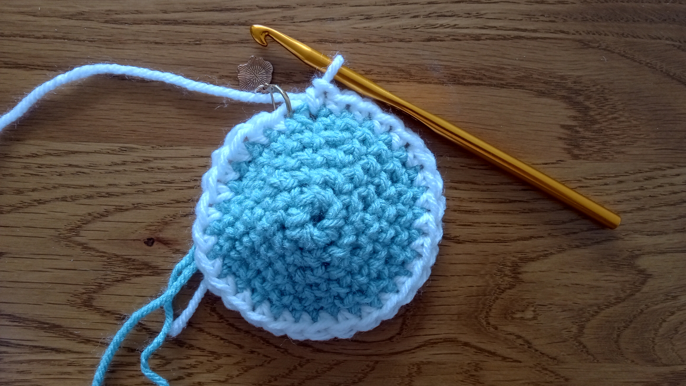
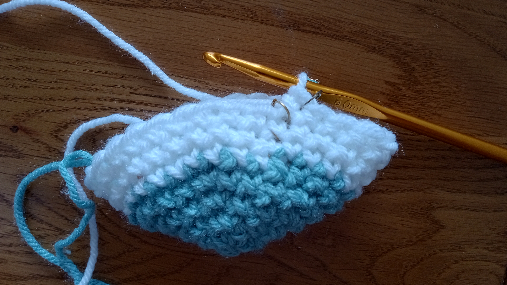
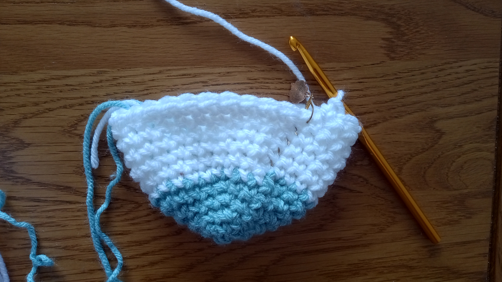

## Stage 3: Decreasing

You'll now close the top of the planet using "decrease" stitches (see [Stitch terminology](#stitch-terminology) above). This part of the pattern is essentially the inverse of Stage 1 - for every increase in Stage 1, you do a decrease in Stage 3.

The rounds below count _down_ to the end of the pattern. Start from the number **one less** than the number of rounds you did in stage 1 (N-1) - so if you did 5 rounds of increases, start from round 4 here.

**Round N:** N-1 sc, 1 decrease, repeat until end of round. (N*6 stitches)

**Round 4:** 3 sc, 1 decrease, repeat until end of round. (24 stitches)

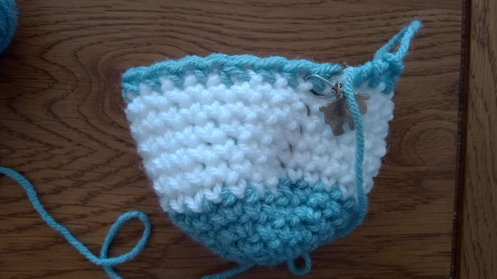

**Round 3:** 2 sc, 1 decrease, repeat until end of round. (18 stitches)

**Round 2:** 1 sc, 1 decrease, repeat until end of round. (12 stitches)

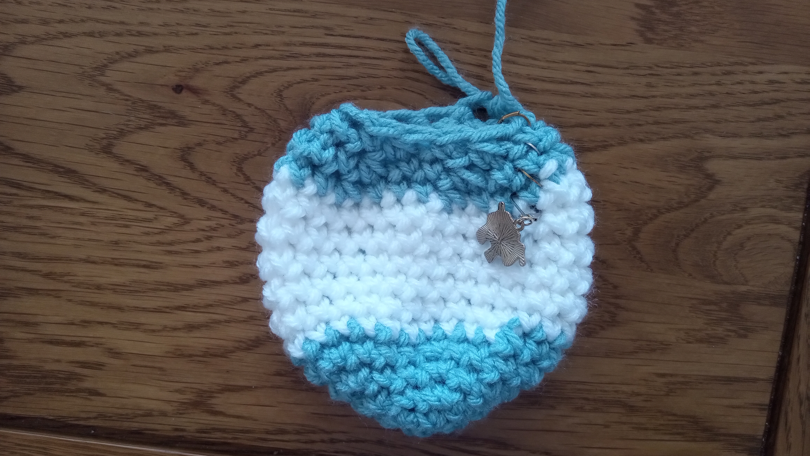

Before completing the final round, stuff the ball. There is stuffing available at [Tekhnē-cal Village][tekhne-cal].

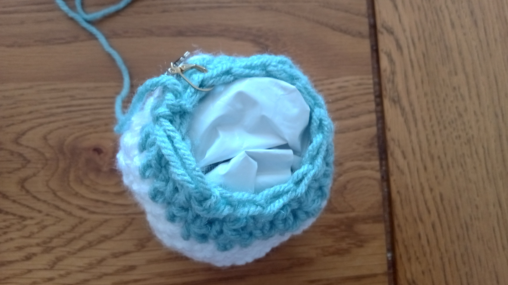

**Round 1:** 6 decreases. (6 stitches)

Cut your yarn, leaving a long tail. Use a blunt tapestry needle to sew through the top of the final stitches, then pull the opening closed. You can weave in the end of the yarn or use it for hanging the planet.

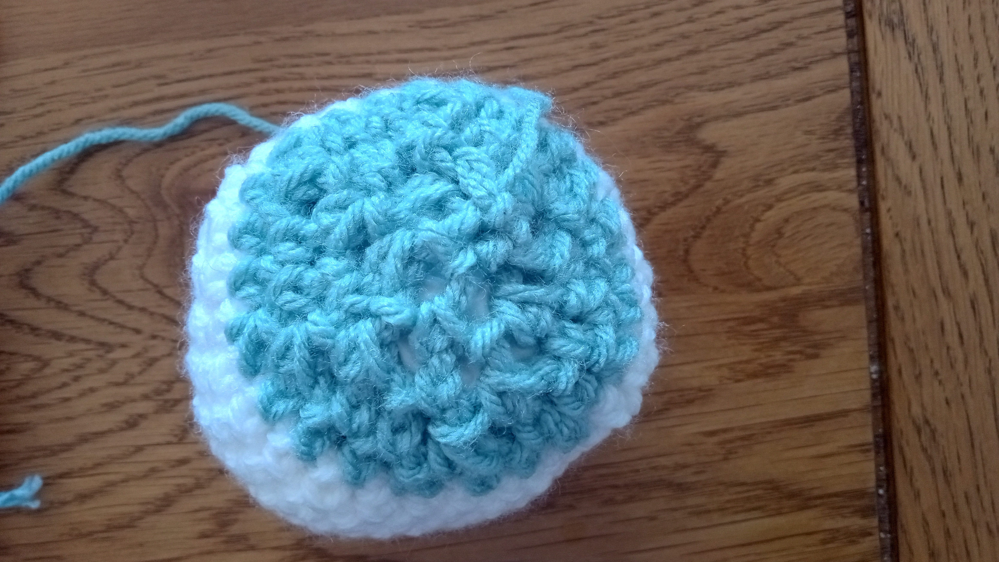

## Stage 4: Add your planet to the solar system! (optional)

[Submit your planet to the website][submit-planet], then [visit the Arts tent][map-location] to hang it in the space.

If you'd like to take your planet home with you after the weekend, that's fine - come and remove it from the Arts tent when you're leaving.

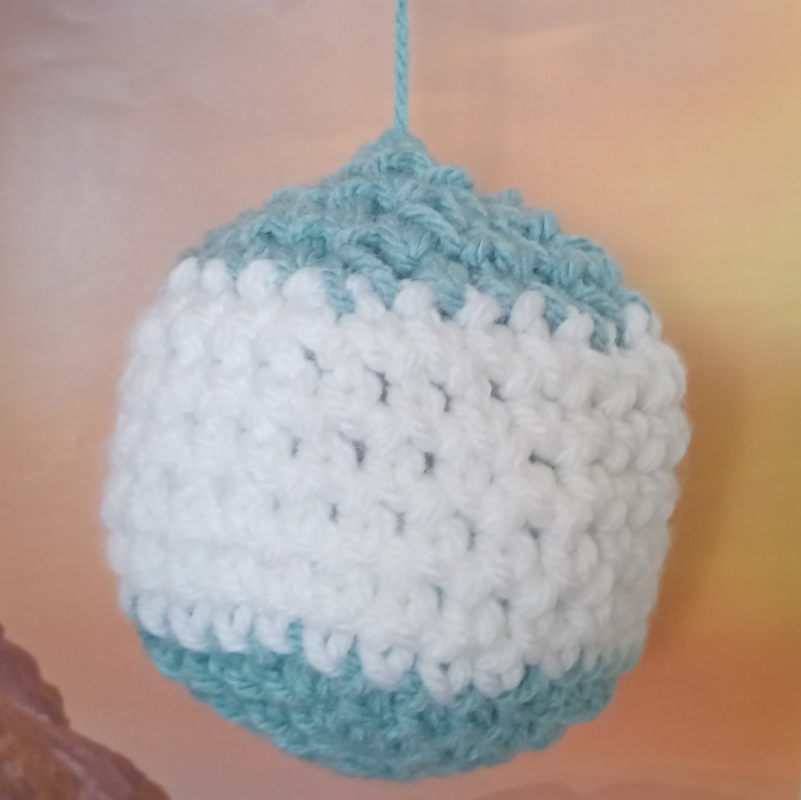

