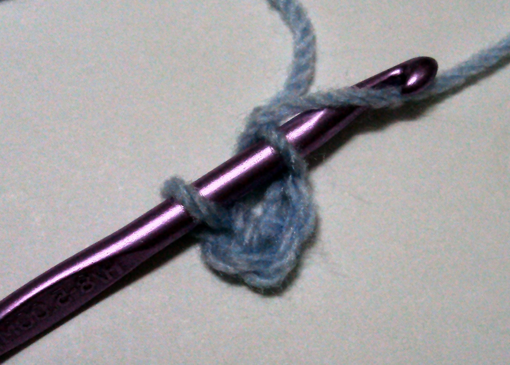

# Crochet Planet

**Level:** Beginner

**Yarn weight:** Chunky (6.0mm hook) recommended, but any yarn can be used with an appropriately sized hook.

**Source:** [Eli][eli]'s brain, cross-referenced with <https://www.supergurumi.com/crochet-shapes-crochet-balls-and-spheres>. Step-by-step pictures by Eli will be added soon.

## Stitch terminology

This pattern uses [US stitch terminology](https://easycrochet.com/uk-to-us-crochet-terms/) (the same as the EMF workshop teaches).

* ch: chain stitch
* st: stitch (any)
* sc: single crochet
* 1 sc: single crochet into the next stitch
* X sc: single crochet into each of the next X stitches
* 1 increase: two single crochets into the next stitch
* round: in a circular pattern, rows are called rounds. You do not flip your work between rounds, so you are always working on the same side of the piece.

**Tip:** Add a stitch marker to the last stitch of each round to help keep track of where you are in the pattern.

## Stage 1: Increasing

You'll start the planet by crocheting a flat circular panel using "increase" stitches. The more rounds you do, the larger your planet will be. If using 6mm yarn, doing 5 increasing rounds will make a planet with a diameter of around 12 cm.

**Beginner adaptation:** decide roughly how much time you want to spend on your planet in total (45-60 mins recommended). Divide it by 3, and do as many rounds of stage 1 as you can in that amount of time.

**Foundation ring.** Work 4 ch and join with a ss to the first ch, forming a ring.

**Round 1:** 6 sc into the ring. (6 stitches)

**Round 2:** 2 sc into next stitch (known as an "increase"), repeat until end of round. (12 stitches)

**Round 3:** 1 sc, 1 increase, repeat until end of round. (18 stitches)

**Round 4:** 2 sc, 1 increase, repeat until end of round. (24 stitches)

**Round 5:** 3 sc, 1 increase, repeat until end of round. (30 stitches)

**Round N:** N-2 sc, 1 increase, repeat until end of round. (N*6 stitches)

Make a note of how many rounds you did (N) before moving on to the next stage.

## Stage 2: the middle bit

You'll now stop increasing and crochet the same number of stitches every round.

_Optional:_ change color in the first stitch of this stage.

For each round, make 1 sc in every stitch (N*6 stitches). Do the same number of rounds as you did in stage 1, plus one (N+1) - so if you did four rounds in stage 1, you should do five rounds in stage 2.

## Stage 3: Decreasing

You'll now close the top of the planet using "decrease" stitches. This part of the pattern is essentially the inverse of Stage 1 - if you did N rounds of increases, you will do N-1 rounds of decreases.

To make a decrease: [instructions to come]

The rounds below count _down_ to the end of the pattern. Start from the number one less than the number of rounds you did in stage 1 (N-1) - so if you did 5 rounds of increases, start from round 4 here.

_Optional:_ change color in the first stitch of this stage.

**Round N:** N-1 sc, 1 decrease, repeat until end of round. (N*6 stitches)

**Round 4:** 3 sc, 1 decrease, repeat until end of round. (24 stitches)

**Round 3:** 2 sc, 1 decrease, repeat until end of round. (18 stitches)

**Round 2:** 1 sc, 1 decrease, repeat until end of round. (12 stitches)

Before completing the final round, stuff the ball. There is stuffing available at [Tekhnē-cal Village][tekhne-cal].

**Round 1:** 6 decreases. (6 stitches)

Cut your yarn, leaving a long tail. Use a blunt tapestry needle to sew through the top of the final stitches, then pull the opening closed. You can weave in the end of the yarn or use it for hanging the planet.

## Stage 4: Add your planet to the solar system!

[Submit your planet to the website][submit-planet], then [visit the installation][location] to hang it in the space.

This step is optional – it's also completely fine to take your planet home with you instead.

