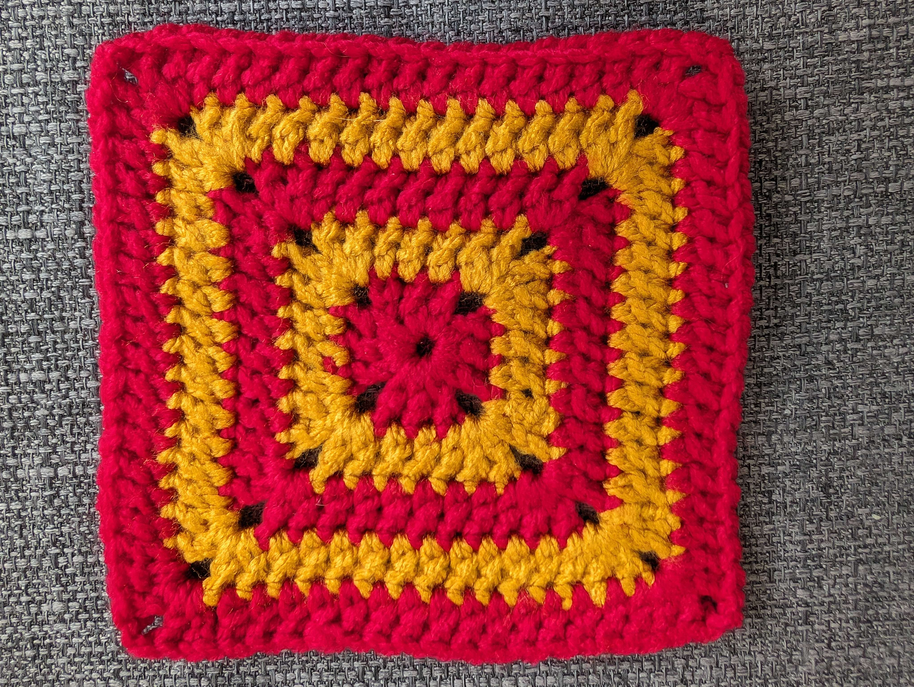

# Solid-Sided Granny Square

**Level:** Beginner

**Yarn weight:** Chunky (6.0mm hook) or [adapt for DK yarn (4.0mm hook)](#adapt-for-dk-yarn-40mm-hook)

**Source:** Adapted from [My Crochet Bible](https://isbnsearch.org/isbn/9780241320358) and [Sarah Maker](https://sarahmaker.com/solid-granny-square-no-gaps/)

## Pattern

This pattern uses [US stitch terminology](https://easycrochet.com/uk-to-us-crochet-terms/) (the same as the EMF workshop teaches).

**Stitch Key:**
* ch: chain stitch
* ss: slip stitch
* dc: double crochet
* st: stitch (any)

**Foundation ring.** Work 4 ch and join with a ss to the first ch, forming a ring.

**Round 1.**
Work 3 ch, then 2 dc in the ring, then 2 more ch; *then 3 dc in the ring and 2 ch. Repeat from * 2 more times. Join the round with a ss to the top of the first chain. Fasten off and optionally change colour.

**Round 2.** Join new yarn in any 2-ch space. Ch 3, work 1 dc, ch 2, work 2 dc in that same space. *1 dc in each of next 3 st, then work 2 dc, ch 2, work 2 dc all in the next 2-ch space. Repeat from * 2 more times. 1 dc in each of next 3 st, then join the round with a ss to the top of the first chain. Fasten off and optionally change colour.

**Round 3.** Join new yarn in any 2-ch space. Ch 3, work 1 dc, ch 2, work 2 dc in that same space. *1 dc in each st along this side of square, then work 2 dc, ch 2, work 2 dc all in the next 2-ch space. Repeat from * 2 more times. 1 dc in each st along the last side of square, then join the round with a ss to the top of the first chain. Fasten off and optionally change colour. Check if you are at the necessary size yet, and stop if you are.

**Round 4.** Repeat round 3.

**Finishing.** Weave in all ends.

### Modifications

* To remove the corner gaps, instead of (ch 2) for the corners, use (1 dc, 1 tr, 1 dc). tr = triple crochet, formed in the same way as the double crochet but wrapping the yarn around the hook twice instead of once (compared to a dc) at the start of the stitch, and then pulling yarn through two loops at a time like normal.

## Adapt for DK yarn (4.0mm hook)

The pattern is the same, but your stitches will be smaller and so you will need more rounds to make a square of the same size. After round 4, hopefully you have the hang of the repeating pattern you need to make and how it grows with each round - continue making rounds in the same way until you reach the required size.