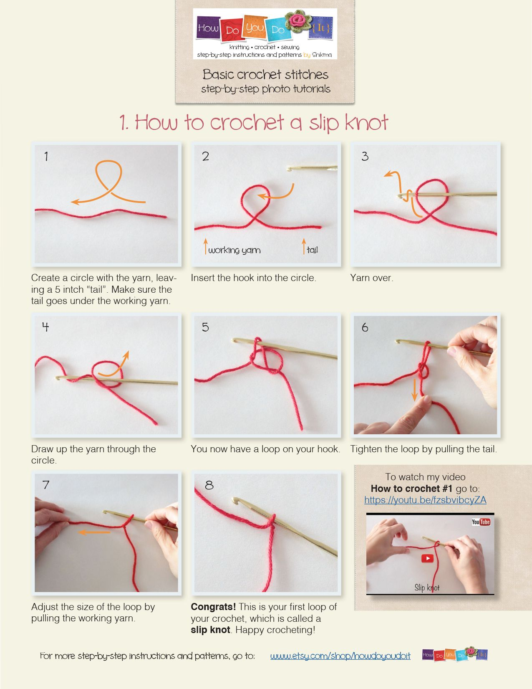
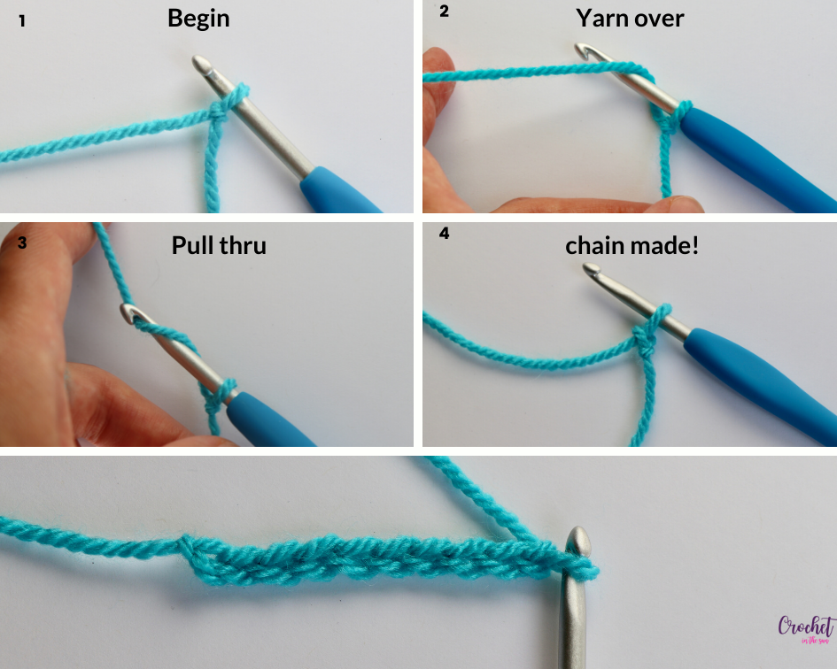
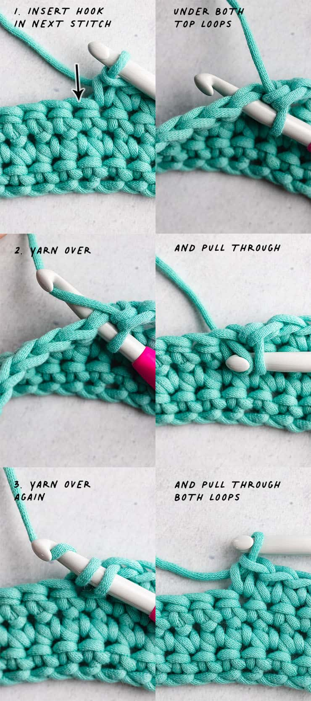
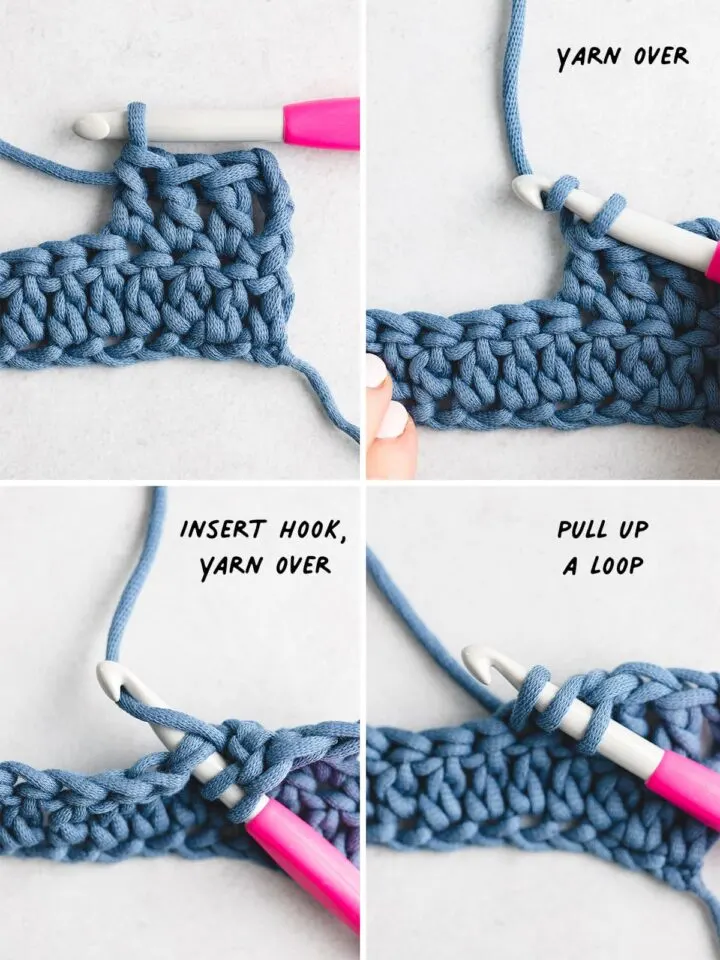
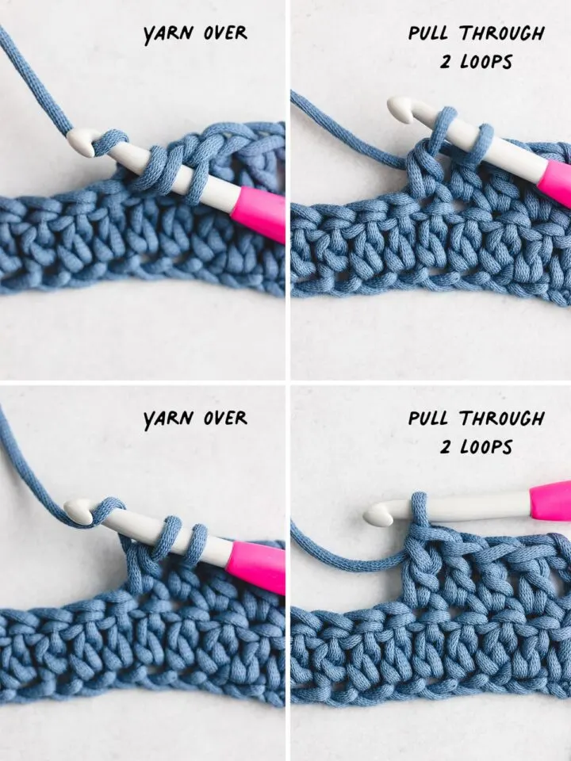
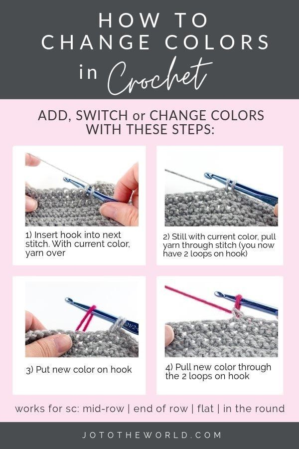
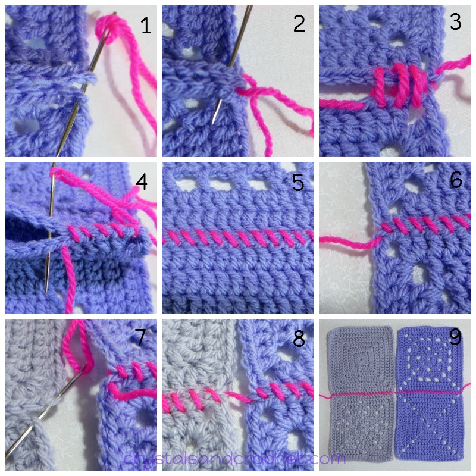

# Slip Knot, Chain Stitch, and Slip Stitch

## Slip Knot

## Chain Stitch

## Slip Stitch

## Single Crochet (US) / Double Crochet (UK)

Images from Sarah Maker

## Double Crochet (US) / Treble Crochet (UK)

Images from Sarah Maker

## Changing Colour

## Whip Stitch (for joining squares)

