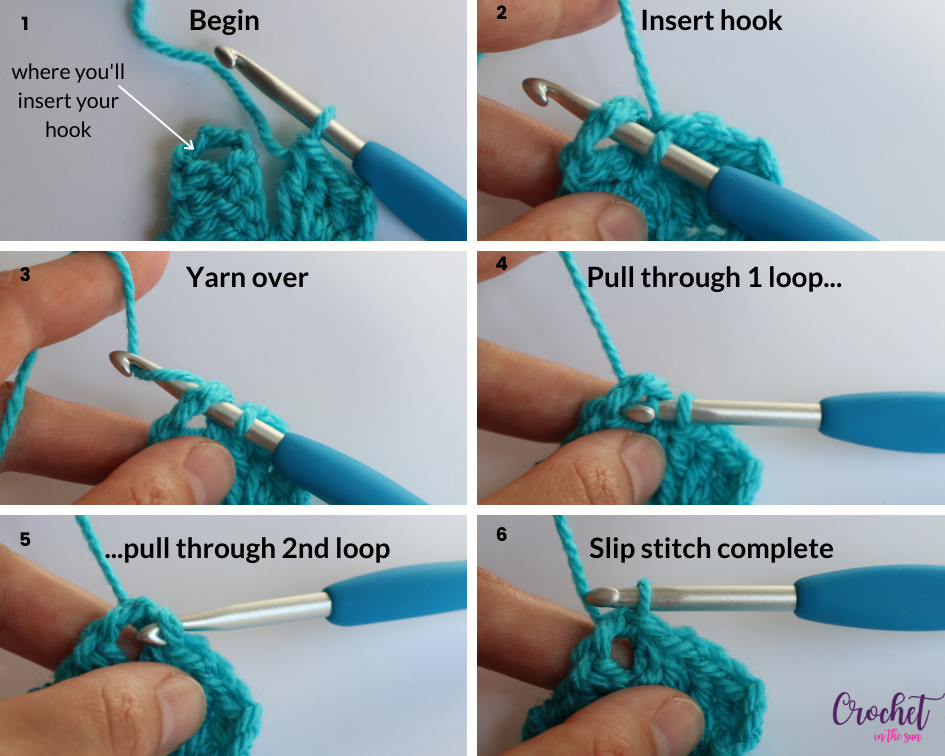

# Stitch Reference

## Holding Hook

### Option 1 - pencil hold

### Option 2 - knife hold

### Option 3

Hold in whatever way is most comfortable for you!

## Tensioning Yarn

### Option 1

### Option 2

### Option 3

Wrap the yarn in whatever way works for you! As long as you feel that you have good control of your yarn as you work your stitches, anything goes.

## Slip Knot

## Chain Stitch

## Slip Stitch

## Single Crochet (US) / Double Crochet (UK)

Images from Sarah Maker

## Double Crochet (US) / Treble Crochet (UK)

Images from Sarah Maker

## Changing Colour

## Whip Stitch (for joining squares)

